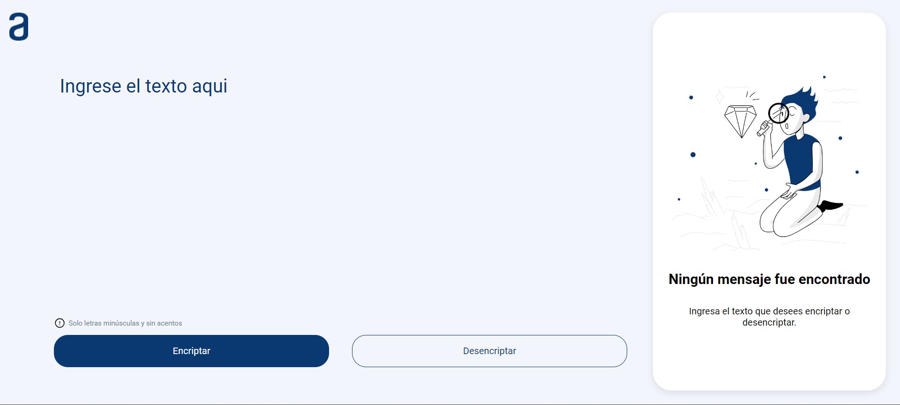
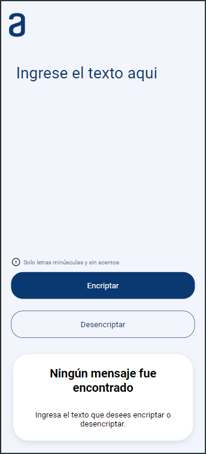
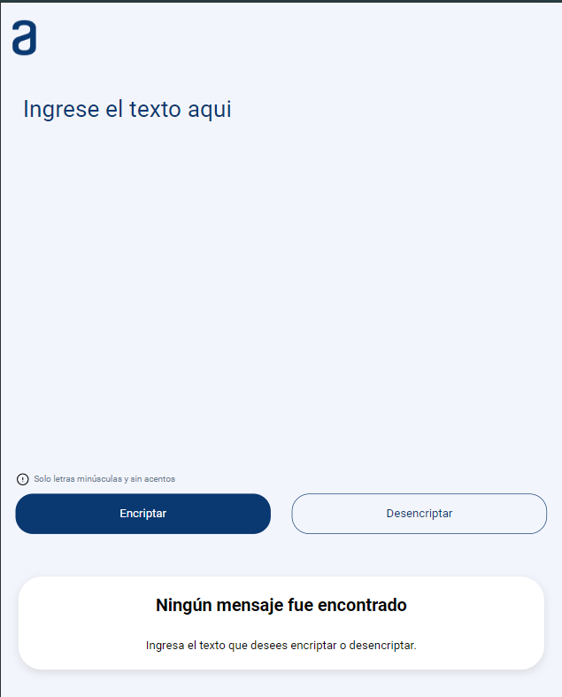

# ChallengeAlura-Encriptador

## Descripción del Proyecto
Este proyecto es una aplicación web desarrollada para encriptar y desencriptar textos mediante un sistema de sustitución de letras. Su principal objetivo es permitir a los usuarios intercambiar mensajes secretos que solo pueden ser entendidos por aquellos que conocen la clave de encriptación. La aplicación se diseñó con un enfoque en la simplicidad y la usabilidad, asegurando que cualquiera pueda proteger su comunicación de manera efectiva.

<kbd>
  
</kbd>

 ## Funcionalidades
- Encriptar Texto: Convierte letras específicas en secuencias predefinidas para proteger el contenido del mensaje.
- Desencriptar Texto: Transforma el texto encriptado de vuelta a su forma original para que el receptor pueda leer el mensaje.
- Copiar Texto: Un botón permite copiar el texto encriptado o desencriptado al portapapeles con un solo clic, facilitando su uso en otras aplicaciones.
- Interfaz Intuitiva: La página cuenta con campos claros para la inserción de texto y opciones de encriptación o desencriptación, con resultados mostrados directamente en la pantalla.

## Vista previa del proyecto

##### Vista Mobile

##### Vista Tablet

##### Vista Desktop

## Guía de uso
Insertar el Texto: Escriba el mensaje que desea encriptar o desencriptar en el campo de texto.
Seleccionar la Acción: Elija entre las opciones de "Encriptar" o "Desencriptar" según la necesidad.
Ver el Resultado: El texto transformado aparecerá en la pantalla.
Copiar el Resultado: Use el botón de copiar para llevar el texto encriptado o desencriptado al portapapeles y utilícelo en cualquier otra aplicación.
